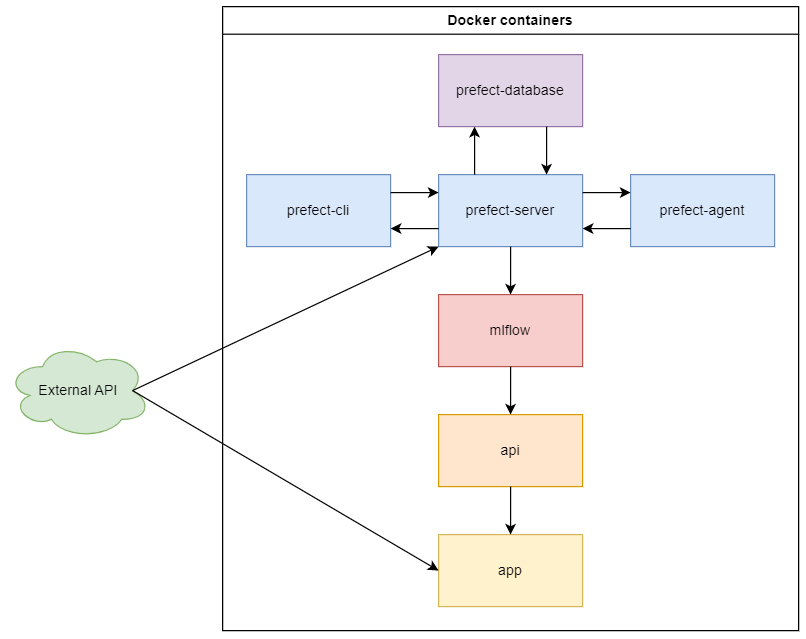
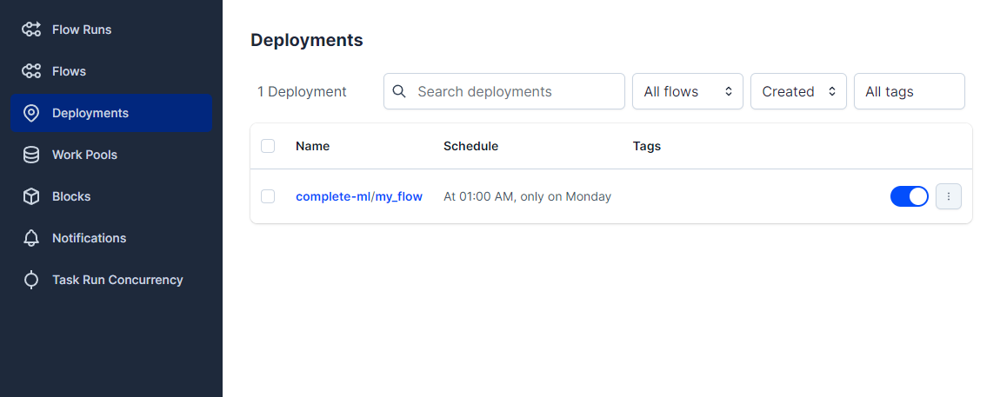
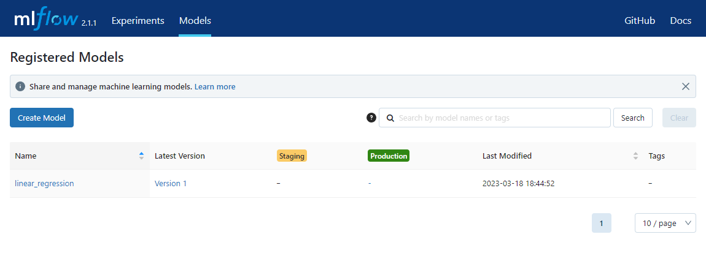
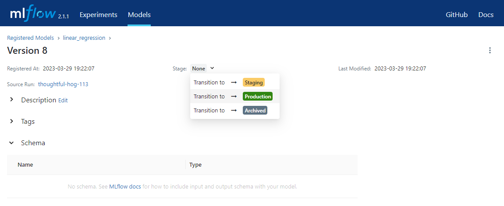

# 5MLDE

School MLOps project for SUPINFO.


## Context

>In this MLOps project, you are requested to develop a complete orchestrated pipeline that can:
>- Perform data ingestion and quality checks
>- Train a model, log the model's performances and save it to the MLflow registry
>- Deploy your model
>
>You will leverage mlops tools and techniques seen in the course you received.


## Subject

Our subject is related to a previous personal project. It is about predicting the price over the time of the Ogrine, a virtual currency from the game DOFUS. This project is a proof of concept; we will simply use a linear regression for the prediction.


## Infrastructure

The main flow is defined in `./flows/workflow.py:complete_ml`. It takes care of downloading and preprocessing the data, separating the data into a test set and a training set, and training/evaluating a Linear Regression model. This model will be logged and saved on an MLFlow instance every week automatically thanks to Prefect.
A REST API made with FastAPI is available with a route to get the predictions of the next 7 days, and a ReactJS application to visualize the result.


The infrastructure is deployed with Docker as follows:

- `prefect-server`: The main Prefect server, the one with which we will interact with its API and UI.
- `prefect-agent`: Allows to execute the different tasks of a workflow.
- `prefect-cli`: Container that is only used to interact with the Prefect CLI, especially for building and deploying a workflow.
- `prefect-database`: Database used by `prefect-server`.
- `mlflow`: The MLFlow instance on which to track model logs, and exploit the models via its API.
- `api`: REST API that will retrieve the model in production from MLFlow and can return predictions.
- `app`: Frontend application that will display the predictions provided by `api`.



## Deploy

The deployment will be done using Docker, so you obviously need to [install Docker](https://docs.docker.com/engine/install) first.

1. Clone or download the project repository
```
git clone https://github.com/Skkay/5MLDE
cd ./5MLDE
```

2. Pull and build the custom Docker images
```
docker compose build --pull --no-cache
```

3. Deploy and run the stack
```
docker compose up
```

With the <u>docker-compose.yml</u> unchanged: 
- Prefect UI is on port *4200*
- MLFlow is on port *5000*
- The API is on port *8080*
- The web app is on port *3000*

## Run

### Prefect

1. When *prefect-cli* is ready, build the workflow

*Note:* 
- *prefect-cli* is the container name defined in the <u>docker-compose.yml</u> at `services.prefect-cli.container_name`.
- The values of options *pool* and *work-queue* refer to the *prefect-agent* command in the <u>docker-compose.yml</u> at `services.prefect-agent.command`.
- The value of option *params* refer to the `complete_ml` flow function parameters ([source](https://github.com/Skkay/5MLDE/blob/dfb69343ae218d695a5ca71b89781024aa55f820/flows/workflow.py#L120)), and the value of *url* is the external Ogrine API.

```
docker exec prefect-cli \
	prefect deployment build \
	--name my_flow \
	--pool default-agent-pool \
	--work-queue default \
	--skip-upload \
	--params='{"url":"https://ogrine-rates.skkay.fr/ogrineRates?sort=desc"}' \
	--cron "0 1 * * 1" \
	workflow.py:complete_ml
```

The file `./flows/complete_ml-deployment.yaml` should be created.

More info at https://docs.prefect.io/concepts/deployments/#build-the-deployment.

2. Create the workflow deployment

*Note:* 
- *prefect-cli* is the container name defined in the <u>docker-compose.yml</u> at `services.prefect-cli.container_name`.

```
docker exec prefect-cli \
	prefect deployment apply complete_ml-deployment.yaml
```

More info at https://docs.prefect.io/concepts/deployments/#create-a-deployment.

3. Check the workflow is visible from the Prefect UI (http://localhost:4200), under *Deployments*:



4. You can now wait the schedule to be trigger or perform a *Quick run* for testing.

### MLFLow

After a Prefect flow run (automatically or via *Quick run*), you should be able to see it from MLFlow (http://localhost:5000), under *Models*:



1. Set the most recent version as *Production*

- From the MLFlow models page, click the latest version name "*Version x*"
- Click *Stage: None* and select *Transition to -> Production*:



The production version is used by the API, determined in the <u>docker-compose.yml</u> at `servicies.api.environment.MODEL_URI`.

### API

Nothing to do. You can get the predictions for the next 7 days in a JSON format on the endpoint `GET /seven-days-forecast` (http://localhost:8080/seven-days-forecast).

### Web app

Nothing to do. The **straight line** is the price over the time and the **dot line** is the 7-days predictions.

## Possible improvements
- Use [Great Expectations](https://greatexpectations.io) to validate incoming data and ensure that they are conform during the train/test phase.
- Use a custom Prefect Docker image (for *prefect-agent* and *prefect-cli*) and install Python requirements to it, instead of runing `pip install` at every `docker compose up`.
- Automatically define latest models as *Production*.

## Extra
- The "external API" repository: https://github.com/Skkay/Ogrine-Rates_Server
- The web applcation used: https://github.com/Skkay/Ogrine-Rates_Client
